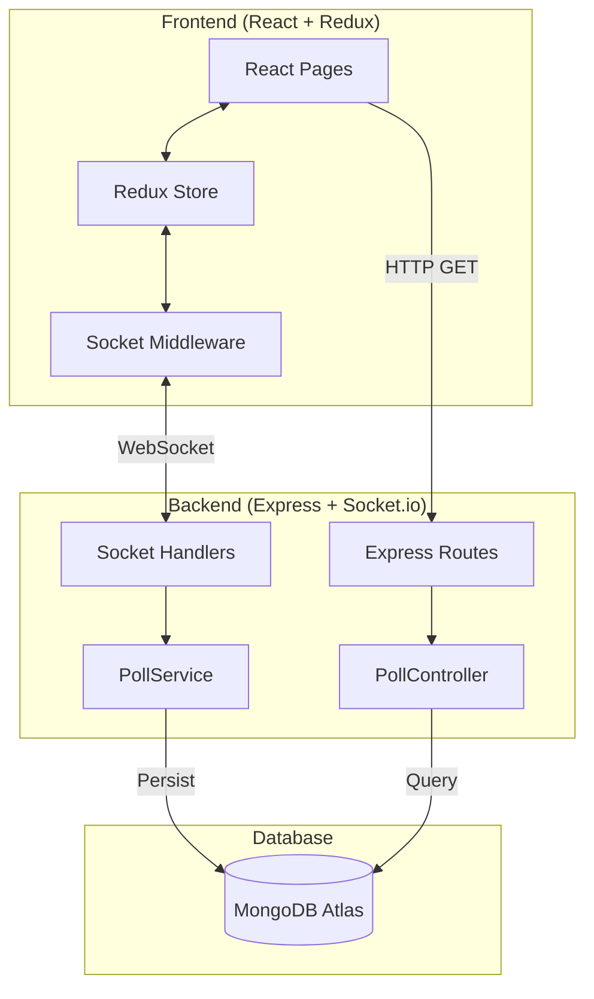
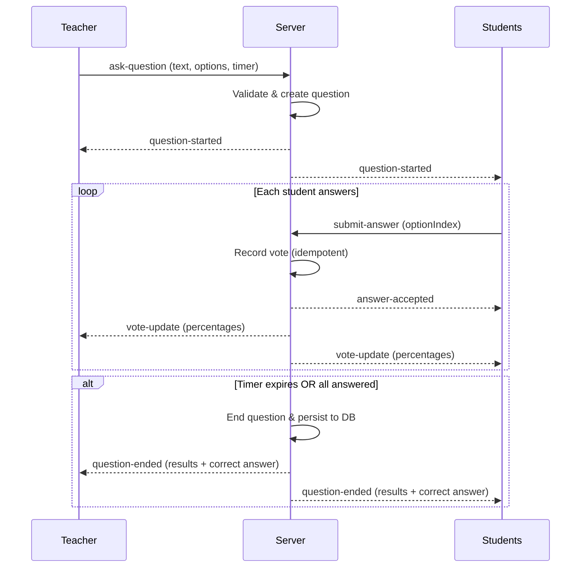

# Live Polling System

A real-time live polling system built for classroom interactions where teachers can create polls, students can answer them, and everyone sees results update in real-time.

    

---

## Features

### Must-Have
- **Live Polling** — Teacher creates questions with multiple options; students answer in real-time
- **Real-time Results** — Both teacher and students see vote percentages update live via WebSockets
- **Correct Answer Reveal** — Correct option highlighted when the question ends

### Good-to-Have
- **Configurable Timer** — Teacher selects poll duration (15s / 30s / 45s / 60s)
- **Kick Students** — Teacher can remove disruptive students from the session
- **Auto-end** — Poll ends automatically when timer expires or all students have answered
- **Resilience** — Full state recovery on page refresh (sessionStorage + server-side state preservation)

### Bonus
- **Live Chat** — Real-time chat between teacher and students with a slide-out panel
- **Poll History** — All past polls stored in MongoDB and viewable by the teacher

---

## Architecture

### System Overview



### Data Flow — Poll Lifecycle




## Tech Stack

| Layer | Technology |
|-------|-----------|
| **Frontend** | React 19, TypeScript 5.8, Vite 7 |
| **State** | Redux Toolkit + Custom Socket Middleware |
| **Styling** | Tailwind CSS 4, Lucide Icons, Google Fonts (Sora) |
| **Backend** | Node.js, Express 4, TypeScript |
| **Real-time** | Socket.io 4.7 (WebSockets) |
| **Database** | MongoDB (Mongoose 8) |
| **Notifications** | Sonner (toast library) |

---

## Project Structure

```
├── client/                    # React frontend
│   ├── src/
│   │   ├── components/        # Reusable UI components
│   │   │   ├── ChatParticipantsPanel.tsx
│   │   │   ├── Logo.tsx
│   │   │   └── ToasterConfig.tsx
│   │   ├── hooks/
│   │   │   └── usePollTimer.ts    # Shared countdown timer hook
│   │   ├── pages/             # Route-level page components
│   │   │   ├── TeacherCreatePage.tsx
│   │   │   ├── TeacherActivePage.tsx
│   │   │   ├── TeacherResultsPage.tsx
│   │   │   ├── PollHistoryPage.tsx
│   │   │   ├── StudentNamePage.tsx
│   │   │   ├── StudentWaitingPage.tsx
│   │   │   ├── StudentQuestionPage.tsx
│   │   │   └── StudentKickedPage.tsx
│   │   ├── store/             # Redux state management
│   │   │   ├── index.ts           # Store configuration
│   │   │   ├── hooks.ts           # Typed useAppDispatch/useAppSelector
│   │   │   ├── socketMiddleware.ts # Socket.io ↔ Redux bridge
│   │   │   └── slices/
│   │   │       ├── sessionSlice.ts # Role, phase, connection
│   │   │       ├── pollSlice.ts    # Active question, votes
│   │   │       └── chatSlice.ts    # Chat messages, participants
│   │   ├── types/
│   │   │   └── index.ts           # Shared TypeScript interfaces
│   │   ├── App.tsx            # Routes + PhaseNavigator
│   │   └── main.tsx           # Entry point with Redux Provider
│   └── package.json
│
├── server/                    # Express + Socket.io backend
│   ├── src/
│   │   ├── index.ts           # Server entry, middleware, DB connection
│   │   ├── types.ts           # Socket event type definitions
│   │   ├── controllers/
│   │   │   └── PollController.ts  # REST endpoint handlers
│   │   ├── routes/
│   │   │   └── poll.ts            # Express route definitions
│   │   ├── services/
│   │   │   └── PollService.ts     # Business logic (pure, no I/O deps)
│   │   ├── socket/
│   │   │   └── handlers.ts        # Thin Socket.io event handlers
│   │   └── models/
│   │       └── PollQuestion.ts    # Mongoose schema
│   └── package.json
│
└── README.md
```

---

## Getting Started

### Prerequisites

- **Node.js** ≥ 18
- **MongoDB** (local or [MongoDB Atlas](https://www.mongodb.com/atlas))

### 1. Clone the repository

```bash
git clone <repository-url>
cd Live_Polling_system
```

### 2. Setup the server

```bash
cd server
npm install
cp .env.example .env
# Edit .env and add your MongoDB URI
```

**.env configuration:**
```env
PORT=5000
MONGODB_URI=mongodb+srv://<user>:<pass>@cluster.mongodb.net/live_polling
CLIENT_URL=http://localhost:5173
```

### 3. Setup the client

```bash
cd ../client
npm install
cp .env.example .env
```

**.env configuration:**
```env
VITE_SERVER_URL=http://localhost:5000
```

### 4. Run in development mode

**Terminal 1 — Server:**
```bash
cd server
npm run dev
```

**Terminal 2 — Client:**
```bash
cd client
npm run dev
```

Open [http://localhost:5173](http://localhost:5173) in your browser.

---

## Usage

1. **Open the app** → Select **"I'm a Teacher"** → You'll land on the poll creation page
2. **Open another tab/browser** → Select **"I'm a Student"** → Enter your name → Wait for a poll
3. **Teacher creates a poll** → Sets question, options, correct answer, timer → Clicks "Ask Question"
4. **Students answer** → Select an option → Click "Submit" → See live results
5. **Poll ends** → Timer expires or teacher clicks "End Question" → Both see final results with correct answer highlighted
6. **View history** → Teacher clicks "View Poll History" to see all past polls from the database

---

## Key Design Decisions

| Decision | Rationale |
|----------|-----------|
| **Redux Toolkit + Custom Middleware** | Socket.io events mapped to Redux actions via middleware — single source of truth, no prop drilling, easy state recovery |
| **Phase-based routing** | Navigation driven by `phase` state (not URL) — prevents invalid states from manual URL edits |
| **Controller-Service pattern** | Business logic in `PollService.ts` (pure functions, testable), Socket handlers are thin I/O orchestrators |
| **Server-authoritative timer** | Timer uses `startedAt` timestamp — late-joining students see correct remaining time |
| **Optimistic UI** | Answer submission updates UI immediately, reverts on server error — feels instant |
| **sessionStorage persistence** | Role/phase survives page refresh — middleware auto-reconnects to server |
| **Graceful DB failure** | Server starts even if MongoDB is down — real-time features work, only history persistence is affected |

---

## Build for Production

```bash
# Server
cd server
npm run build        # Compiles to dist/
npm start            # Runs dist/index.js

# Client
cd client
npm run build        # Outputs to dist/
npm run preview      # Preview production build
```

---

## API Endpoints

| Method | Endpoint | Description |
|--------|----------|-------------|
| `GET` | `/api/history` | Fetch last 50 poll results from DB |
| `GET` | `/api/health` | Health check (for hosting platforms) |

## Socket Events

| Direction | Event | Description |
|-----------|-------|-------------|
| Client → Server | `join-as-teacher` | Register as teacher |
| Client → Server | `join-as-student` | Register as student with name |
| Client → Server | `ask-question` | Create new poll (teacher only) |
| Client → Server | `submit-answer` | Submit vote (student only) |
| Client → Server | `kick-student` | Remove student (teacher only) |
| Client → Server | `end-question` | End poll early (teacher only) |
| Client → Server | `send-chat` | Send chat message |
| Server → Client | `question-started` | New poll broadcast |
| Server → Client | `vote-update` | Live vote percentages |
| Server → Client | `question-ended` | Final results + correct answer |
| Server → Client | `session-state` | Full state recovery on reconnect |

---

